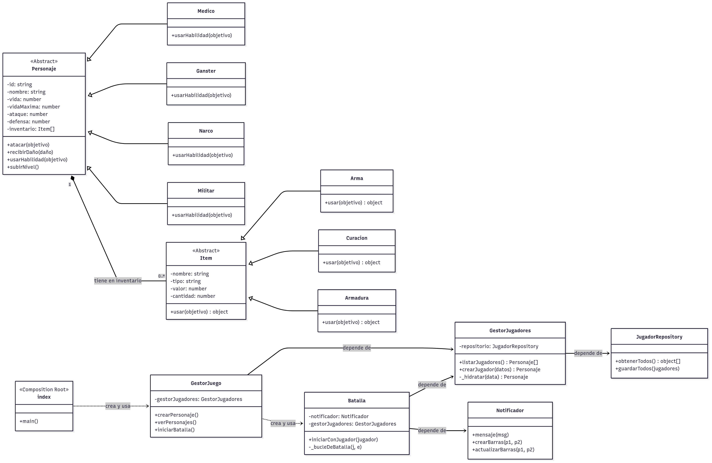

# 🔥 GTA SA RPG 🔥

Un juego de rol (RPG) por consola basado en el universo de Grand Theft Auto: San Andreas. Este proyecto simula un sistema de batallas por turnos donde puedes crear personajes, equipar objetos, luchar contra enemigos icónicos de la saga y enfrentarte a un jefe final. Todo el progreso se guarda localmente en archivos JSON.

Este proyecto fue desarrollado como parte de un taller académico, con un fuerte enfoque en la aplicación de **Programación Orientada a Objetos** y los **principios de diseño SOLID**.

---

## 📜 Tabla de Contenido

1.  [Características Principales](#-características-principales)
2.  [Tecnologías y Librerías](#-tecnologías-y-librerías)
3.  [Instalación y Ejecución](#-instalación-y-ejecución)
4.  [Estructura del Proyecto](#-estructura-del-proyecto)
5.  [Uso del Juego](#-uso-del-juego)
6.  [Principios SOLID Aplicados](#-principios-solid-aplicados)
7.  [Diagrama UML](#-diagrama-uml)
8.  [Gestión del Proyecto](#-gestión-del-proyecto)
9.  [Integrantes del Equipo](#-integrantes-del-equipo)

---

## ✨ Características Principales

* **Creación de Personajes:** Crea tu propio personaje eligiendo un nombre y un rol específico.
* **Sistema de Roles:** Cada rol tiene estadísticas y habilidades únicas:
    * **⚕️ Médico:** Capaz de curarse a sí mismo.
    * **🔫 Gánster:** Realiza un ataque doble en un solo turno.
    * **💣 Narco:** Aplica un efecto de quemadura que causa daño por turno.
    * **🛡️ Militar:** Aumenta su propia defensa temporalmente.
* **Batallas por Turnos:** Un sistema de combate de 3 rondas. Las dos primeras son contra enemigos aleatorios y la tercera es contra un **jefe final**.
* **Inventario Dinámico:** Los personajes tienen un inventario donde pueden guardar y usar armas, armaduras y objetos de curación.
* **IA de Enemigos:** Los enemigos son controlados por una IA básica que puede decidir entre atacar, usar su habilidad especial o consumir un objeto de su inventario.
* **Sistema de Experiencia y Niveles:** Gana experiencia al derrotar enemigos, sube de nivel y mejora las estadísticas de tu personaje.
* **Persistencia de Datos:** El estado de tus personajes (nivel, inventario, etc.) se guarda en archivos `JSON` locales, permitiendo continuar el progreso entre sesiones. La muerte de un personaje es **permanente**.

---

## 💻 Tecnologías y Librerías

| Tecnología      | Descripción                                                |
| :-------------- | :--------------------------------------------------------- |
| **Node.js** | Entorno de ejecución de JavaScript del lado del servidor.    |
| **inquirer** | Para la creación de menús interactivos por consola.        |
| **chalk** | Para dar color y estilo al texto en la terminal.           |
| **cli-progress**| Para renderizar barras de vida dinámicas en tiempo real.   |
| **fs y path** | Módulos nativos de Node.js para la gestión del sistema de archivos. |

---

## 🚀 Instalación y Ejecución

Asegúrate de tener **Node.js v18.0** o superior instalado en tu sistema.

1.  **Clonar el repositorio:**
    ```bash
    git clone https://github.com/BryanVillabona/GTA_SA_RPG.git
    cd gta-sa-rpg
    ```

2.  **Instalar dependencias:**
    ```bash
    npm i chalk@4 boxen@5 inquirer@8 cli-progress cfonts
    ```

3.  **Ejecutar el juego:**
    ```bash
    node index.js
    ```

---

## 📁 Estructura del Proyecto

El proyecto está organizado siguiendo una arquitectura limpia para separar responsabilidades:

```
/ 
├── data/ # Archivos JSON (personajes, enemigos, objetos, jugadores) 
├── models/ # Clases principales (Personaje, Roles, Item, Inventario) 
├── services/ # Lógica de negocio (GestorJuego, Batalla, GestorJugadores, JugadorRepository) 
├── utils/ # Clases de utilidad (Notificador, Presentador) 
├── config.js # Constantes y configuración del juego 
└── index.js # Punto de entrada de la aplicación (Composition Root)
```
---

## 🎮 Uso del Juego

1.  Al iniciar la aplicación, se muestra un **menú principal** con cuatro opciones:
    * `Crear personaje`
    * `Ver y activar personajes`
    * `Iniciar batalla` (deshabilitado si no hay un personaje activo)
    * `Salir`
2.  Al **crear un personaje**, se te pedirá un nombre y un rol. El nuevo personaje se guardará en `data/jugadores.json`.
3.  En una **batalla**, en cada turno podrás elegir entre `Atacar`, `Usar Habilidad` o `Usar Objeto`.
4.  Al finalizar cada ronda victoriosa, se te otorgará experiencia y podrás elegir un **nuevo objeto** para añadir a tu inventario.
5.  Si la vida de tu personaje llega a `0`, este **muere permanentemente** y es eliminado de `data/jugadores.json`.

---

## ⭐ Principios SOLID Aplicados

Este proyecto fue diseñado aplicando los 5 principios SOLID para garantizar un código limpio, modular y escalable.

| Principio                             | Aplicación en el Proyecto                                                                                                                                                                                                                         |
| :------------------------------------ | :------------------------------------------------------------------------------------------------------------------------------------------------------------------------------------------------------------------------------------------------ |
| **S - Responsabilidad Única (SRP)** | Cada clase tiene una sola razón para cambiar. Por ejemplo, `JugadorRepository` solo se encarga de leer/escribir en el archivo JSON, `GestorJugadores` maneja la lógica de los jugadores, y `Notificador` solo se ocupa de la salida por consola.     |
| **O - Abierto/Cerrado (OCP)** | El sistema está abierto a la extensión, pero cerrado a la modificación. Podemos agregar nuevos `Roles` o nuevos tipos de `Item` (ej. `ItemDeVeneno`) creando nuevas clases que hereden de `Personaje` o `Item`, sin necesidad de modificar el código de la clase `Batalla`. |
| **L - Sustitución de Liskov (LSP)** | Todas las subclases de `Personaje` (Médico, Gánster, etc.) y de `Item` (Arma, Curación) pueden ser utilizadas en cualquier lugar donde se espere la clase base sin alterar el comportamiento del programa.                                           |
| **I - Segregación de Interfaces (ISP)** | (Simulado en JS) Las clases no dependen de métodos que no utilizan. Al separar `JugadorRepository` de `GestorJugadores`, evitamos que las clases que solo necesitan la lógica del jugador dependan también de los métodos de acceso a archivos. |
| **D - Inversión de Dependencias (DIP)** | Los módulos de alto nivel no dependen de los de bajo nivel; ambos dependen de abstracciones. Esto se logra a través de la **Inyección de Dependencias**, centralizada en `index.js` (nuestro *Composition Root*), donde se crean todas las instancias y se "inyectan" unas en otras. |

---

## 📊 Diagrama UML

El siguiente diagrama de clases ilustra la arquitectura y las relaciones entre los componentes clave del sistema.



---

## 🎯 Gestión del Proyecto

El seguimiento de tareas, la planificación de sprints y la gestión general del proyecto se realizaron a través de un tablero en ClickUp.

**➡️ [Ver tablero en ClickUp](https://link-del-tablero.com)**

---

## 👥 Integrantes del Equipo

| Integrante              | Rol en el proyecto                |
| :---------------------- | :-------------------------------- |
| **Bryan Villabona** | Desarrollador/Estudiante           |
| **Sergio Liévano** | Desarrollador/Estudiante |
| **Juan Sebastián Gómez**| Desarrollador/Estudiante      |